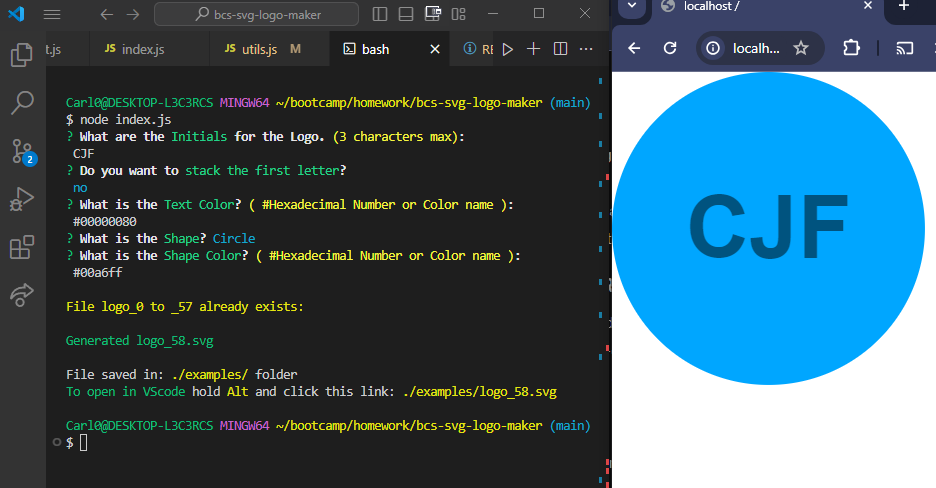

# Bcs-svg-logo-maker



## Description

This is a simple SVG Logo maker

Live Demo: [Bcs-svg-logo-maker demo](https://drive.google.com/file/d/1KYtm6smAa3rsaZN7-zLfK3G8VYeNR2bB/view)


## Table of Content
- [Getting Started](#getting-started)
- [Installation](#installation)
- [Usage](#usage)
- [Test Instructions](#test-instructions)
- [Author](#author)
- [Contribution](#contribution)
- [Questions](#questions)
- [License](#license)


## Getting Started

This section will guide you through setting up the project locally. <br>By the end of this guide, you will have a working version of My Project running on your machine.

### Prerequisites

Before you begin, ensure you have the following installed:

- [Node.js](https://nodejs.org/) (v14.0 or later)

- [Git](https://git-scm.com/)

- A text editor like [VSCode](https://code.visualstudio.com/)


## Installation
Follow these steps to get your development environment set up:
```bash
git clone https://github.com/febres0492/bcs-svg-logo-maker.git
cd bcs-svg-logo-maker
npm install
```


## Usage
Run this command in the terminal:
```bash
npm start
```


## Test Instructions
Run this command in the terminal:
```bash
npm test
```


## Author
Carlos Febres


## Contribution
Contributions are welcome


## Questions
For questions please get in contant:  
**Github** Profile: https://github.com/Febres0492  
**Email**: Febres0492@gmail.com


## License
[](https://opensource.org/licenses/MIT)

This project is licensed under the MIT License - see the [LICENSE](https://opensource.org/licenses/MIT) for details.